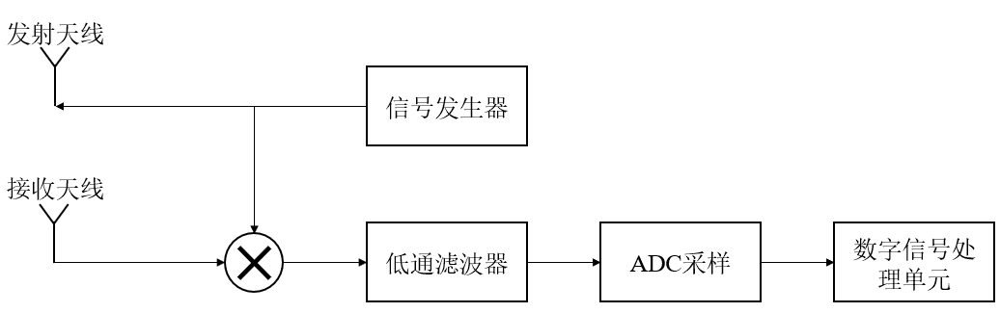
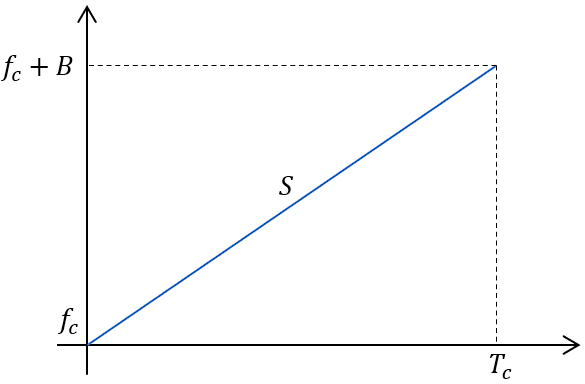
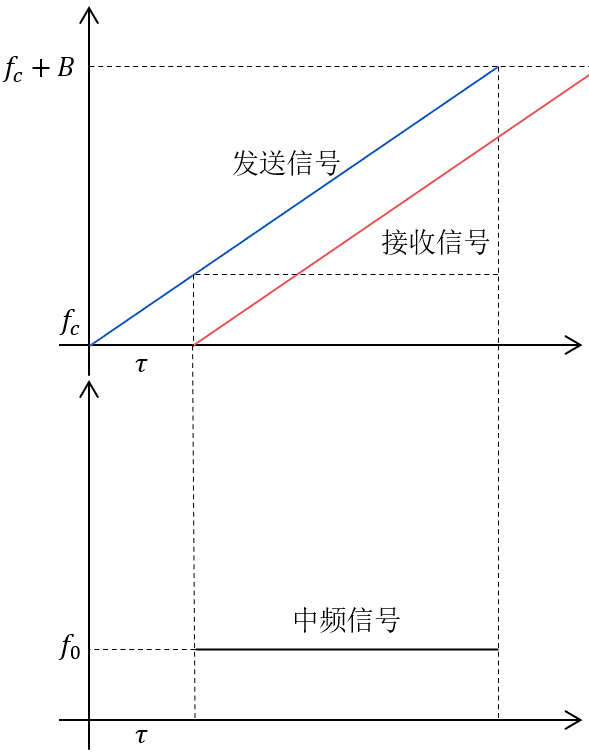
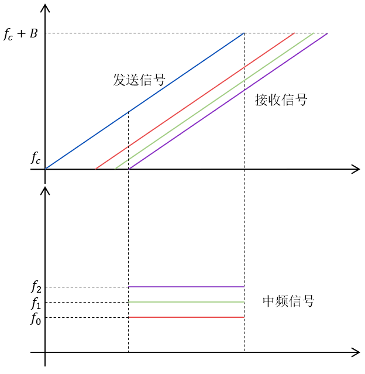
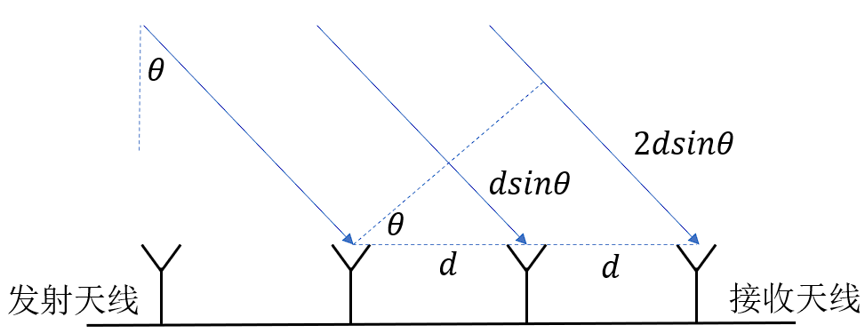
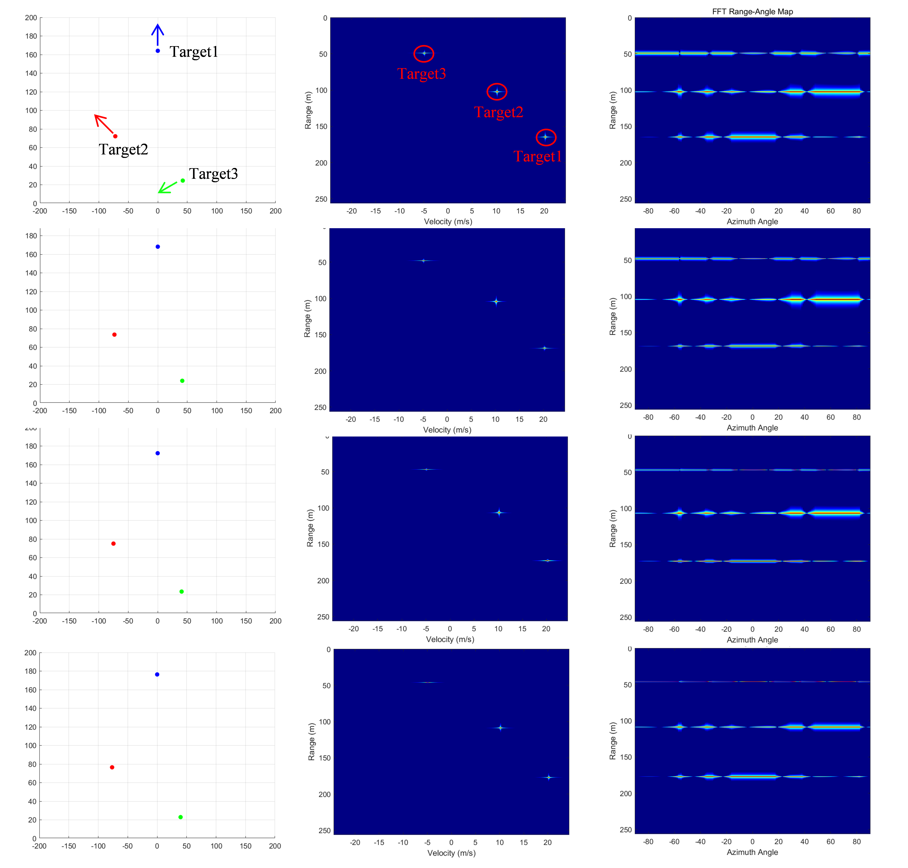
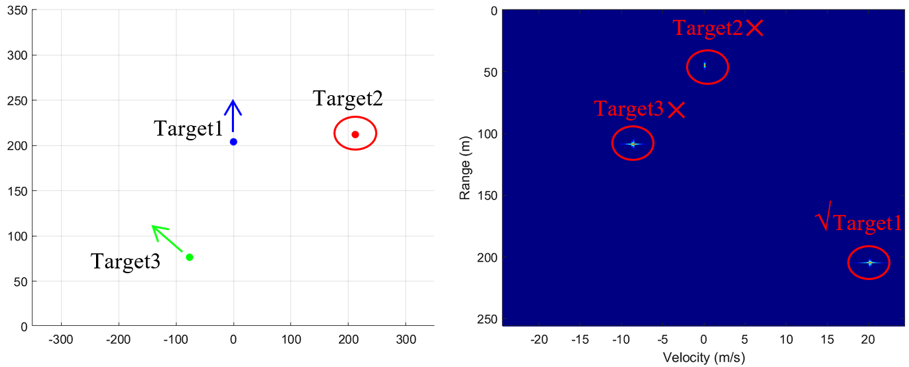

# 毫米波雷达基本原理教程

## 1.学习目标
1. 学习理解线性调频连续波(LFMCW)雷达的基础知识;
2. 以一个实际探测需求,设计毫米波雷达的相关参数,并进行仿真验证。

## 2.学习进展
## 2.1 毫米波雷达探测的基本流程

毫米波雷达系统通过发射线性调频连续波信号,经物体反射后,由雷达天线接收,对接收的信号进行分析从而得到反射物体的距离、速度、角度信息。完整的雷达探测系统主要包括:信号发生器、发射天线、接收天线、混频器、低通滤 波器以及后续的数字信号处理单元,信号的处理流程如下图所示:

 

 
图 1 毫米波雷达系统处理流程 

## 2.2 毫米波雷达探测基本原理

毫米波雷达发射的信号为线性调频脉冲信号,即信号的频率随时间线性变化, 设其起始频率为$f_c$,带宽为$B$,脉冲时间为$T_c$,调频脉冲斜率为$S$,则信号的频率与时间关系如下图所示:

 

 
图 2 线性调频脉冲频率变化示意图 

由上图可以得到,FMCW信号的频率与时间的关系满足下式:

$$f(t) = f_c + St \tag{1}$$

其中,调频斜率可由下式得到:

$$S = \frac{B}{T_c} \tag{2}$$

由此可以得到,FMCW雷达所发射的调频脉冲信号的时域表达式如下:

$$s(t) = \sin\left[\int 2\pi f(t) dt\right] = \sin(2\pi f_c t + \pi S t^2) \tag{3}$$

由上式中可以发现,调频脉冲信号的相位变化包含时间的一次项和二次项。一次项系数代表着相位的瞬时变化率,即信号的频率,而二次项系数代表着频率的变化率,即调频斜率。

### ➢ 距离测量原理

在发射信号经过物体反射,由雷达接收天线接收后,由于时延的存在导致接收信号的相位与发射信号相位不同,经过混频器与低通滤波后,得到的中频信号频率一定,且其频率与时延直接相关,中频信号的示意图如下所示:

 

 
图 3 中频信号示意图 

混频器的作用是将两个信号进行相乘,根据积化和差公式,得到的信号包含两个部分:两个信号的相位之差与两个信号的相位之和。由于起始频率较高,经过叠加后的信号频率将超过可用实现的采样频率且不包含可用的目标信息,因此经过低通滤波得到的信号为两信号的相位之差部分。

由上图可以发现,由于收发信号间时延的存在,收发信号同一时刻下的频率差恒定,由此得到的中频信号的频率恒定,即仅包含单个频率。假设目标与雷达的距离为$d$,光速为$c$,则时延满足下式:

$$\tau = \frac{2d}{c} \tag{4}$$

则中频信号的频率$f_0$(即收发信号同一时刻的频率差)为:

$$f_0 = S\tau = \frac{S2d}{c} \tag{5}$$

中频信号的起始相位$\phi_0$为中频信号起始时刻收发信号的瞬时相位之差,即:

$$\phi_0 = 2\pi f_c \tau = \frac{4\pi f_c d}{c} = \frac{4\pi d}{\lambda} \tag{6}$$

其中,波长$\lambda$为起始频率对应的波长。从而得到中频信号$s_{bf}(t)$的时域表达式为:

$$s_{bf}(t) = \sin(2\pi f_0 t + \phi_0) \tag{7}$$

由此可以发现,中频信号的频率$f_0$与目标距离成比例,可通过测量中频信号的频率从而得到目标的距离信息。在同一时刻下,存在多个目标,经反射的回波被雷达接收,中频信号会变成多个单频信号的叠加,为实现不同距离目标的分离,可通过对中频信号进行频谱分析。多目标中频信号示意图如下所示:

 

 
图 4 多目标中频信号示意图

由傅里叶变换可知,在谱带上实现多个频率成分的分辨,两个频率之间的频率差需要满足:

$$\Delta f > \frac{1}{T_c} \tag{8}$$

则可以两个目标距离差$\Delta d$所需满足下式:

$$\frac{S2\Delta d}{c} > \frac{1}{T_c} \Rightarrow \Delta d > \frac{c}{2ST_c} \tag{9}$$

也就是雷达的距离分辨率$d_{res}$满足:

$$d_{res} = \frac{c}{2ST_c} = \frac{c}{2B} \tag{10}$$

中频信号中最高的频率成分对应着最远的目标的回波,即:

$$f_{max} = \frac{S2d_{max}}{c} \tag{11}$$

由于数字信号处理中,为实现对模拟信号的处理,在中频信号经过低通滤波器滤除高频杂波后,需要对中频信号进行采样得到数字信号。为实现对信号的有效分析,根据奈奎斯特采样定理,中频信号最高频率成分与采样频率需满足如下关系:

$$f_{max} < f_s \Rightarrow \frac{S2d_{max}}{c} < f_s \tag{12}$$

则可以得到雷达的最大探测距离$d_{max}$为:

$$d_{max} = \frac{f_s c}{2S} \tag{13}$$

需要注意的是,上述奈奎斯特采样定理是针对复信号而言,对与一般的实信号,需要满足采样率为信号最大频率的2倍;而在TI雷达的系统设计中,为提高频谱利用率,往往采用正交频分复用的技术传输复信号,由于复信号的频谱为单频带,因此采样率仅需大于待采样信号的最大频率即可实现不失真的采样。在进行多个目标的距离测量时,往往通过对采样后的信号进行FFT变换得到频谱,这一操作称为距离FFT。

### ➢ 速度测量原理

在上述对中频信号的分析中,其初始相位$\phi_0$由目标与雷达的距离决定,当距离发生微小变化时,由于波长较短(毫米级),从而使得中频信号的初始相位发生较大变化,通过对不同中频信号的初始相位$\phi_0$的测量可以实现目标速度的测量。

对于连续发射的两个调频脉冲,所得到的中频信号对应的初始相位分别为:

$$\phi_{01} = \frac{4\pi d_1}{\lambda}, \phi_{02} = \frac{4\pi d_2}{\lambda} \tag{14}$$

则相位变化$Delta \phi$与距离变化$\Delta d$关系如下:

$$\Delta \phi = \frac{4\pi \Delta d}{\lambda} \tag{15}$$

上述距离变化是在一个调频脉冲的时间下实现的,则可以得到目标速度满足如下关系:

$$\Delta \phi = \frac{4\pi \Delta d}{\lambda} = \frac{4\pi v T_c}{\lambda} \Rightarrow v = \frac{\Delta \phi \lambda}{4\pi T_c} \tag{16}$$

因此可以通过测量两个连续的中频信号的相位差实现对速度的测量,当测量范围内包含多个目标多个速度时,为实现不同目标的区分,往往采用连续发射多个调频脉冲的方法,得到多个中频信号,并对其进行采样,得到的数据称为帧。

假设一个帧内发射了$N$个调频脉冲,得到这个$N$个中频信号,为实现不同中频信号的相位的测量,同一距离下对于不同中频信号进行FFT变换得到对应的频谱,称为多普勒FFT,也称慢时间FFT。所以对于个采样数据下,为实现频谱上的可分辨,速度差$\Delta v$需要满足下式:

$$\begin{cases} \Delta \nu = \frac{(\Delta \phi_1 - \Delta \phi_2)\lambda}{4\pi T_c} = \frac{\Delta \omega \lambda}{4\pi T_c}\\ \Delta \omega > \frac{2\pi}{N} \end{cases} \Rightarrow \Delta \nu > \frac{\lambda}{2NT_c} \tag{17}$$

从而得到速度分辨率为:

$$v_{res} = \frac{\lambda}{2NT_c} = \frac{\lambda}{2T_f} \tag{18}$$

由于相位具有周期性,仅当相位的绝对值小于时,可以确定相位的大小:

$$ |\Delta \phi| <\pi \tag{19}$$

从而得到速度满足:

$$|v| = \frac{\Delta\phi\lambda}{4\pi T_c} < \frac{\lambda}{4T_c} \tag{20}$$

即雷达最大的探测速度为:

$$v_{max} = \pm \frac{\lambda}{4T_c} \tag{21}$$

在处理时,对于得到的一帧数据,一般使用2DFFT实现距离和速度的测量, 即首先在快时间维上进行1DFFT,得到距离谱,之后在慢时间维上再次进行1DFFT得到多普勒谱,所得到的结果称为距离-多普勒谱图,能够直观的反映探测空间内目标的位置和速度信息。

### ➢ 角度测量原理

在雷达接收回波信号时,可以由于距离与天线间隙相比差别较大,可认为回波到达雷达时为平面波,由于路程差的存在,同样导致不同天线接收的信号的相位发生变化,通过比较不同天线通道接收信号的相位实现对角度的测量。雷达天线接收信号模型示意图如下:

 

 
图 5 雷达天线接收信号模型示意图

由上图可以得到,相邻天线接收信号路程差$\Delta d$为:

$$\Delta d = dsin\theta \tag{22}$$

从而造成的相位差$\Delta \phi$为:

$$\Delta \phi = 2\pi f_c \frac{\Delta d}{c} = \frac{2\pi d \sin\theta}{\lambda} \tag{23}$$

得到目标角度为:

$$\theta = \sin^{-1}(\frac{\Delta\phi\lambda}{2\pi d}) \tag{24}$$

与雷达最大速度的推导类似,为实现不模糊的角度测量,相位差的绝对值需小于$\pi$,即:

$$\frac{2\pi dsin\theta}{\lambda} < \pi \Rightarrow \theta < \sin^{-1}\left(\frac{\lambda}{2d}\right) \tag{25}$$

可以发现当天线间距为半波长时,最大探测角达到最大值为±90°,实现了最大的探测角,这也是毫米波雷达系统中设计接收天线阵列为半波长的原因。

为实现位于不同角度的目标的分辨,在M个接收天线阵列中,需要相位差满足:

$$\frac{2\pi dsin\theta_1}{\lambda} - \frac{2\pi dsin\theta_2}{\lambda} > \frac{2\pi}{M} \tag{26}$$

当$\theta_1, \theta_2$均趋于0时,有如下公式:

$$\sin\theta_1 - \sin\theta_2 \approx \cos\theta \cdot \Delta\theta \tag{27}$$

其中$\theta$可取${(\theta_1 + \theta_2)}/2$,因此可以得到$\Delta\theta$满足:

$$\frac{2\pi d\cos\theta}{\lambda} \Delta\theta > \frac{2\pi}{M} \Rightarrow \Delta\theta > \frac{\lambda}{Md\cos\theta} \tag{28}$$

由此可以得到,当接收天线阵列为半波长,目标角度趋于0时,雷达角度分辨率为:

$$\theta_{res} = \frac{2}{M} \tag{29}$$

由此可以发现,毫米波雷达的角度分辨率是随目标角度非线性变化,并且根据函数的性质,目标角度越大时,相同角度差导致的函数值变化越小。为使相位变化能够分辨,此时需要相邻目标的角度差越大,即角度分辨率越差。

由此,总结雷达探测距离、速度、角度关系如下表:

表 1 毫米波雷达探测关键参数
| 参数名 | 最大程度                                            | 分辨率                                                       | 备注  |
|-----|-------------------------------------------------------|-----------------------------------------------------------|-----|
| 距离  | $d_{max} = \frac{f_s c}{2S}$                          | $d_{res} = \frac{c}{2B}$                                  | 线性  |
| 速度  | $v_{max} = \pm \frac{\lambda}{4T_c}$                  | $v_{res} = \frac{\lambda}{2T_f}$                          | 线性  |
| 角度  | $\theta_{max} = \pm 90^\circ (d = \frac{\lambda}{2})$ | $\theta_{res} = \frac{2}{M} (\theta \rightarrow 0^\circ)$ | 非线性 |

## 2.3 毫米波雷达探测参数设计

根据上述毫米波雷达分析,现根据一个实际的雷达探测需求,来设计毫米波雷达的相关参数。根据TI毫米波雷达实际探测参数设置作为参考,确定所需设计雷达的探测参数,TI毫米波雷达不同探测能力雷达参数设计如下表所示:
表 2 TI 毫米波雷达经典探测参数参考表
| Parameter                             | Units  | LRR   | MRR   | SRR   | USRR |
|---------------------------------------|--------|-------|-------|-------|------|
| Max unambiguous range                 | m      | 225   | 125   | 45    | 22.5 |
| Sweep bandwidth                       | MHz    | 300   | 540   | 750   | 1500 |
| Ramp slope                            | MHz/us | 10    | 12    | 15    | 30   |
| Inter-chirp duration                  | us     | 8     | 10    | 12    | 50   |
| Number of chirps                      | -      | 256   | 128   | 128   | 128  |
| Range resolution                      | m      | 0.50  | 0.28  | 0.20  | 0.1  |
| Chirp duration                        | us     | 30    | 45    | 50    | 50   |
| Max umambiguous relative velocity (1) | kmph   | 92.28 | 63.75 | 56.56 | 35.3 |
| Max beat frequency                    | MHz    | 15    | 10    | 4.5   | 4.5  |
| ADC sampling rate (complex)           | Msps   | 16.67 | 11.11 | 5.00  | 5.00 |
| Number of samples per chirp           | -      | 500   | 500   | 250   | 250  |
| Range FFT size                        | -      | 512   | 512   | 256   | 256  |
| Frame time (total)                    | ms     | 9.728 | 7.04  | 7.94  | 12.8 |
| Frame time (active)                   | ms     | 7.68  | 5.76  | 6.4   | 6.4  |
| Radar data memory required            | KB     | 2048  | 1024  | 512   | 512  |

参考上表,本次设计毫米波雷达探测能力参数如下表:

表 3 雷达探测能力参数
|--------------|-------|--------|
| 雷达参数         | 最大程度  |分辨率|
| 距离           | 200m  | 0.5m   |
| 速度           | 20m/s | 0.2m/s |

调频带宽作为最重要的一个参数之一,直接确定雷达的距离分辨率,为满足探测要求,可以计算得到所设计雷达的调频带宽为:

$$B = \frac{c}{2d_{res}} = 300 \, MHz \tag{30}$$

其次考虑速度参数,目前实际应用的毫米波雷达起始频率一般在77GHz,本次雷达设计也采用该设定,为满足雷达的最大不模糊速度和速度分辨率,计算得到脉冲重复周期与帧周期为:

$$\begin{cases} T_{c} = \frac{\lambda}{4v_{max}} = \frac{c}{4v_{max}f_{c}} \approx 48.7 us \\ T_{f} = \frac{\lambda}{2v_{res}} \approx 9.7 ms \end{cases} \tag{31}$$

并由此可以得到一帧内的脉冲数约为202,为便于后续数字信号处理的FFT操作,一帧内的脉冲数一般为2的整数次幂,同时为保证满足雷达探测需求,本次设计选择设定一帧内的脉冲数为256,并调整脉冲重复周期为40us,从而得到调整后两者结果为:

$$\begin{cases} T_c = 40 us \\ T_f = 10.24 ms \end{cases} \tag{32}$$

并得到对应的雷达对目标速度的探测能力为:

$$\begin{cases} v_{max} = \pm \frac{\lambda}{4T_c} \approx \pm 24.35 m/s \\ v_{res} = \frac{\lambda}{2T_f} \approx 0.19 m/s \end{cases} \tag{33}$$

在无空闲时间的情况下,由此可以确定雷达的调频斜率$S$:

$$S = \frac{B}{T_c} = 7.5 MHz/us \tag{34}$$

同样地,为方面后续数字信号处理,单个脉冲内的采样点数应为2的整数次幂,设定为512,得到采样频率$f_s$:

$$f_s = \frac{N}{T_c} = 12.8 MHz \tag{35}$$

由此得到的最大探测距离为:

$$d_{max} = \frac{f_s c}{2S} = 256 m \tag{36}$$

满足上述所要求的雷达探测能力,并将相关参数总结如下表:

| 表 4 雷达相关参数表 |            |
|-------------|------------|
| 参数名         | 参数值        |
| 最大不模糊距离     | 256 m      |
| 距离分辨率       | 0.5 m      |
| 最大不模糊速度     | 24.35 m/s  |
| 速度分辨率       | 0.19 m/s   |
| 带宽          | 300 MHz    |
| 调频脉冲        | 40 us      |
| 单脉冲采样点      | 512        |
| 单帧脉冲数       | 256        |
| 采样率         | 12.8 MHz   |
| 调频斜率        | 7.5 MHz/us |

## 2.4雷达仿真验证

为验证上述毫米波雷达系统是否符合要求,设计仿真实验进行雷达探测能力的验证。本次仿真实验中,设计了雷达阵列为一发八收,仿真帧数为100 帧,其余相关参数按照上述参数设计进行设置。雷达天线阵列位置如下图所示:

 

 
图 6 仿真天线阵列位置

上图中,蓝色为发射天线,红色为接收天线,接收天线间隔为半波长。在模拟信号发射与回波接收时,未将发射信号与回波信号直接相乘再采样,而是通过模拟采样点的相位变化,实现混频过程,这种方法提高了仿真计算的准确性。本次仿真中设置了3个运动的目标，与雷达的相对位置关系分别为：(160,0°,20 m/s)、(100, −45°,10m/s)、(50, 60°, −5m/s)，仿真100帧过程中部分位置以及距离-速度谱图、距离-角度谱图变化如下所示:

 

 
图 7 仿真结果对比图

从距离-速度谱图中可以清晰地确定目标的距离以及速度,但在距离-角度谱图中距离可以较为清晰地分辨,而角度难以辨认,因此需要更加精细的方法对角度信息进行处理。

为测试所设计的毫米波雷达是否符合要求,修改三个目标的运动状态,与雷达的相对位置关系分别为:(200,0°,20m/s),(300,45°,0m/s),(100,−45°,40m/s),得到仿真结果如下所示:

 

 
图8 验证雷达系统最大探测能力仿真结果

从中可以发现,目标1的距离速度能够正确地在RD谱中展现出来,符合探测需求,而目标2和目标3因相关运动状态超过雷达探测能力,由于频谱的混叠,导致在谱图中出现了对应的假象,并不代表该位置有真实目标存在。

为验证分辨率的能力,设定四个目标运动状态为:(5,0°,0 m/s),(5.5,0°,0 m/s),(8,30°,0 m/s),(8,−30°,0.2 m/s),得到仿真结果如下:

 

 
图 9 验证雷达系统探测分辨能力仿真结果

从上图可以看到,相距0.5m的静止目标可以在距离-速度谱图中通过距离维分辨出来,同一距离下,速度差距0.2m/s的运动目标可以在距离-速度谱图中通过速度维分辨出来,满足所要求的雷达探测需求。

## 2.5MUSIC角度估计

使用角度FFT进行目标角的估计分辨率有限,因此需要能够实现更精细的角度估计算法,其中MUSIC(Multiple Signal Classification,多重信号分类)算法能够实现高精度的角度估计,其核心假设是信号源向量与噪音向量相互独立,则信号到达矢量与噪音子空间的基向量正交,利用这一点搜索角度谱。对于$M$个阵列天线,空间中存在$D$个信号源,则接收信号可表示如下:

$$X(t) = A(\theta)s(t) + n(t) \tag{37}$$

其中,$X(t)$为$M$个阵列的接收信号,$A(\theta)$为$M$个阵列$D$个信号源的到达向量,$s(t)$为D个信号源,$n(t)$为$M$个阵列的接收噪声。MUSIC算法步骤如下:

1. 计算接收信号协方差矩阵
通过接收信号计算协方差矩阵:

$$R_{xx} = \frac{1}{M} X X^T \tag{38}$$

上式中,$R_{xx}$为的共轭转置,$M$为阵列单元。

2. 对协方差矩阵进行分解

协方差矩阵为对称矩阵,可完全进行分解:

$$R_{xx} = U\Lambda U^T \tag{39}$$

上式中,$U$为特征向量组成的特征矩阵,$\Lambda$为特征值组成的对角矩阵。对特征值排序得到信号向量空间与噪音向量空间:

$$ \begin{cases} \lambda_{i} = sort(\Lambda), i = 1, ..., M - 1 \\ U_{s} = U[\lambda_{1}, ..., \lambda_{D}] \\ U_{n} = [\lambda_{D+1}, ..., \lambda_{M}] \end{cases} \tag{40}$$

3. 计算 MUSIC 伪谱

$$P_{MUSIC} = \frac{1}{A^T(\theta)U_s U_s^T A(\theta)} \tag{41}$$

上式中,$A(\theta)$为角$\theta$对应的到达角方向矢量,反映了目标信源到达不同阵列的相位偏移,可由下式计算得到:

$$A(\theta) = \left[1, e^{\frac{2j\pi d_1}{\lambda}\sin\theta}, \dots, e^{\frac{2j\pi d_{M-1}}{\lambda}\sin\theta}\right]^T \tag{42}$$

当为信号源到达角时,方向矢量与噪声向量空间正交,则伪谱趋向无限大,而实际噪声的存在使得伪谱峰值并非无穷大,通过对MUSIC伪谱的搜索进而可以实现对信号源角度的估计。除此之外,MUSIC算法需要确定信号源的个数,在实际未知目标个数时,可采用CFAR检测实现目标个数的获取。

本次仿真中设置了4个运动的目标,与雷达的相对位置关系分别为:[150,0°,20m/s],[100,60°,10m/s],[50,−40°,−5m/s],以及一个位于[-15m,15m],速度为20m/s,向X轴正方向移动的目标,仿真100帧过程中部分位置以及距离-速度谱图、距离-MUSIC角度谱图变化如下所示:

 

 
图 10 MUSIC 算法角度估计

可以发现,利用MUSIC算法提高了角度的估计精度,根据距离-MUSIC角度谱图能够从肉眼直接分辨出目标的角度信息。

## 参考文献

[1] Texas Instruments. mmWave培训系列[EB/OL].[2025-07-25]. https://www.ti.com/video/series/mmwave-training-series.html?HQS=epd-pro-rap-mmwavelaunch-bti-tr-mmwavetrainingseries-wwe.

[2] Texas Instruments. AWR2243相关文档[EB/OL].[2025-07-25]. https://www.ti.com.cn/cn/lit/wp/zhcy075/zhcy075.pdf?ts=1753237575368&ref\_url=https%253A%252F%252Fwww.ti.com.cn%252Fproduct%252Fcn%252FAWR2243.

[3] Dham V.Programming chirp parameters in TI radar devices[J].Application Report SWRA553,Texas Instruments,2017,1457.

[4] Schmidt R.Multiple emitter location and signal parameter estimation[J]. IEEE transactions on antennas and propagation,1986,34(3):276-280.
      